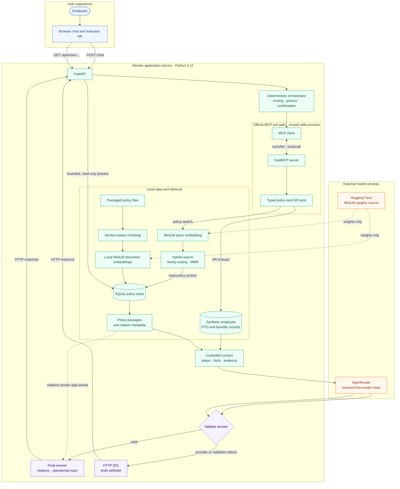

# MSAIE HR Agent

A fictional HR support assistant that combines policy retrieval, structured synthetic employee tools, and required LLM response composition. It cites policy evidence, reports its tool workflow, and gates mock actions on explicit confirmation. It does not access real employee data or production HR systems.

## Architecture



**Reading the diagram:** blue is the user interface, green is app-local processing and data, orange is the external model services, and purple marks the answer-validation boundary. The MCP client and FastMCP server communicate over stdio in the demo and hosted configuration; local quick-start can use in-process MCP. Refusals that stop before evidence retrieval do not call OpenRouter.

### Data and storage

```mermaid
flowchart LR
    subgraph Build[Policy index build]
        DOCS[Policy files] --> CHUNK[Section-aware chunks]
        CHUNK --> EMBED[Local MiniLM document embeddings]
        EMBED --> DB[(SQLite vector index)]
    end

    subgraph Request[Runtime evidence]
        QUESTION[Policy question] --> QUERY[Local MiniLM query embedding]
        DB --> RETRIEVE[Hybrid retrieval + family routing + MMR]
        QUERY --> RETRIEVE
        RETRIEVE --> PASSAGES[Evidence chunks + citation metadata]
        HR[(Synthetic HR records)] --> FACTS[Typed structured facts]
    end

    PASSAGES --> PROMPT[Controlled draft + evidence + structured facts]
    FACTS --> PROMPT
    PROMPT --> COMPOSE[OpenRouter LLM response composition]
    COMPOSE --> CHECK[Application validation]
    CHECK -->|valid| RESPONSE[Answer + citations]
    CHECK -->|invalid or unavailable| SAFE[HTTP 503; draft withheld]
    UI[Browser SQLite viewer] -->|read-only API request| API[FastAPI]
    API -->|bounded document and chunk rows| DB
    DB --> API --> UI
    HF[Hugging Face model source] -. model weights downloaded to app .-> EMBED
    HF -. model weights downloaded to app .-> QUERY

    classDef local fill:#ecfdf5,stroke:#059669,color:#064e3b
    classDef external fill:#fff7ed,stroke:#ea5800,color:#7c2d12
    classDef output fill:#f5f3ff,stroke:#7c3aed,color:#3b0764
    class DOCS,CHUNK,EMBED,DB,QUESTION,QUERY,RETRIEVE,PASSAGES,HR,FACTS,PROMPT local
    class HF,COMPOSE external
    class CHECK,RESPONSE,SAFE output
```



Policy embeddings and the vector index run in the app service. OpenRouter is required for every successful citation-bearing answer: the chain tries Qwen 3.8 27B, Nemotron 3.5 Lightning, and Gemma 4 26B A4B, then `openrouter/free`. The model formats and enriches a controlled draft; it cannot select tools, change eligibility, or authorize actions. Validation fails closed on unavailable, truncated, unsupported, or unsafe output. Requests refused before retrieval return without an LLM call. The active hosted release and its acceptance status are maintained in [deployment status](deployed.md).

The project uses fixed synthetic records so the same demo query produces a repeatable scenario. The workspace includes examples for several employee IDs and a read-only browser for the SQLite policy documents and chunks; vector payloads are not exposed.

## Run locally

Use Python 3.12.

```bash
python3.12 -m venv .venv
source .venv/bin/activate
python -m pip install -r requirements.txt
cp .env.example .env
# Set MSAIE_LLM_API_KEY (or OPENROUTER_API_KEY) in .env, then:
./scripts/start_local.sh
```

The launcher loads `.env`, starts the service, waits for readiness, and opens the browser. The first start builds the SQLite index and loads `sentence-transformers/all-MiniLM-L6-v2` from Hugging Face. Embeddings run inside the app service and are stored in its SQLite vector index; OpenRouter is used for final answer generation. Restart the service after changing `.env`.

For the required protocol path, set `MSAIE_MCP_TRANSPORT=stdio`. `inprocess` is available for quick local development, while the demo and CI exercise the official MCP SDK client and FastMCP server over stdio.

## Configuration and endpoints

Keep provider credentials in the ignored `.env` file or shell environment. Never commit secrets.

- OpenRouter: `MSAIE_LLM_BASE_URL`, `MSAIE_LLM_API_KEY` (or legacy `OPENROUTER_API_KEY` for local runs), and `MSAIE_LLM_FALLBACK_MODEL`.
- Embeddings: `MSAIE_EMBEDDING_*` settings are separate from LLM generation. The default model is `sentence-transformers/all-MiniLM-L6-v2` at 384 dimensions.
- `/`: synthetic HR workspace and evaluator lab.
- `/health` and `/health/ready`: service, SQLite index, MCP, and provider status.
- `/api/index/documents` and `/api/index/documents/{document_id}/chunks`: read-only SQLite index preview without stored vectors.
- `/api/tools`: discover the available MCP tools.
- `/docs`: API schema.

## Project map

| Deliverable | Location |
|---|---|
| Fictional HR policy corpus | `policies/` |
| Source review, requirements, and traceability | `docs/source-materials-review.md`, `specs/`, `docs/traceability-matrix.md` |
| Architecture, design, and decisions | `docs/architecture.md`, `design-and-evaluation.md`, `docs/adr/` |
| Tickets and TDD implementation slices | `tickets/README.md`, `docs/implementation-slices.md` |
| Orchestrator, API, and browser app | `agent/`, `app/` |
| MCP tools (`mcp/` equivalent) | `mcp_server/` (server and tools), `mcp_client/` (protocol client) |
| Synthetic records | `mock_data/` |
| Retrieval evaluation and visualizations | `evaluation/`, `visuals/` |
| Tests and GitHub Actions | `tests/`, `.github/workflows/ci.yml` |
| Review and acceptance evidence | `reviews/`, `evidence/` |
| Demo runbook | `demo/README.md`, `docs/demo-script.md` |
| AI tooling disclosure and deployment status | `ai-tooling.md`, `deployed.md` |

## Verification

Run from the repository root:

```bash
python -m compileall -q app agent rag mcp_server mcp_client evaluation scripts
python -m pytest -q
python -m evaluation.run_evaluation --transport inprocess
python -m evaluation.run_evaluation --transport stdio
python scripts/smoke_mcp.py
```

For hosted acceptance when the provider routes are available, run `python scripts/smoke_hosted_demo.py`. It sends synthetic chat requests through the live app and may consume Free-tier allowance; by default it stops before the confirmation-gated mock email action. The `--confirm-mock-email` option explicitly exercises that fictional local-only action. Output is sanitized. See [deployment status](deployed.md) before using it.

The golden set measures orchestrator behavior and deterministic control-flow proxies; it does not include OpenRouter generation or independent semantic judging. See [evaluation limits and results](evaluation/), [the review](reviews/code-review.md), and the [evidence index](evidence/index.md) for the current acceptance record. Deployment health and live request evidence are in [deployed.md](deployed.md).

## Retrieval visualization

The retrieval comparison chart is checked into the repository and embedded here so it is visible in GitHub. It compares top-k coverage and MMR for the labeled policy queries; the result is corpus-specific, not a general answer-quality score.


See the [retrieval comparison report](evaluation/retrieval-comparison.md) and [chunk ablation report](evaluation/ablation-results.md) for methods and limitations.

## Hosting

- GitHub repository: [MSAIE2027/Project-HR-Agent](https://github.com/MSAIE2027/Project-HR-Agent).
- Assigned Render URL: [project-hr-agent.onrender.com](https://project-hr-agent.onrender.com).
- Deployment procedure: [local-to-Render workflow](docs/local-to-render-workflow.md).
- See [deployed.md](deployed.md) for verified live status and current release evidence.
