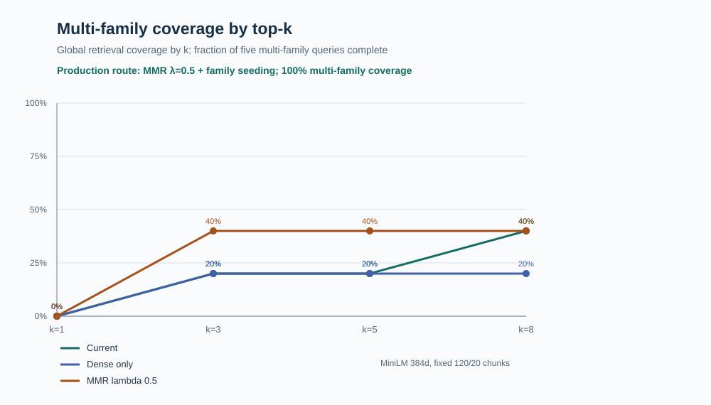

# Quantic MSAIE HR Agent
### Master of Science in AI Engineering (MSAIE)  Project

[](https://github.com/MSAIE2027/Project-HR-Agent/actions/workflows/ci.yml)
[](https://github.com/MSAIE2027/Project-HR-Agent)
[](https://modelcontextprotocol.io/)
[](https://huggingface.co/sentence-transformers/all-MiniLM-L6-v2)
[](https://www.w3.org/WAI/WCAG21/quickref/)
[](https://www.python.org/)

> [!IMPORTANT]
> **Academic Demonstration & Synthetic Data Notice:**
> This application is an academic project developed for the **Quantic School of Business and Technology Master of Science in AI Engineering (MSAIE)** degree program. All corporate policies, employee profiles, leave balances, email drafts, and support tickets are entirely fictional and synthetic. The system contains no real-world personal identifiable information (PII) and has no connection to production human resources information systems (HRIS).

An enterprise human resources agent that implements verifiable policy retrieval, relational employee record lookup, and human-in-the-loop action execution. The system couples Anthropic's **Model Context Protocol (MCP)** with an in-process **quantized INT8 ONNX vector retrieval pipeline** and a **two-phase confirmation gate** for state-changing side-effects.

---

## 1. System Overview

```
+--------------------------------------------------------------------------------------------------+
|                                    SYSTEM ARCHITECTURE FLOW                                      |
+--------------------------------------------------------------------------------------------------+
                                                 |
                                     [ Incoming User Request ]
                                                 |
                                                 v
                                  +------------------------------+
                                  |    FastAPI Request Router    |
                                  +------------------------------+
                                                 |
                                                 v
                                  +------------------------------+
                                  |   Deterministic Gatekeeper   |
                                  |   - Medical PII Refusal      |
                                  |   - Prompt Injection Shield  |
                                  +------------------------------+
                                                 |
                      +--------------------------+--------------------------+
                      |                                                     |
             (Violation Detected)                                  (Compliant Request)
                      |                                                     |
                      v                                                     v
        [ HTTP 200 Refusal Response ]                            +---------------------+
        - Zero tool calls                                        | MCP Gateway Client  |
        - Zero outbound LLM calls                                +---------------------+
                                                                            |
                                                               (stdio IPC transport)
                                                                            |
                                                                            v
                                                                 +---------------------+
                                                                 |    FastMCP Server   |
                                                                 |    (8 Typed Tools)  |
                                                                 +---------------------+
                                                                            |
                                               +----------------------------+----------------------------+
                                               |                                                         |
                                               v                                                         v
                                  +--------------------------+                              +--------------------------+
                                  | Policy Search Tool       |                              | Structured HR Tools      |
                                  | - INT8 ONNX MiniLM       |                              | - Employee Profile       |
                                  | - 182-chunk SQLite Store |                              | - PTO Balance & Accrual  |
                                  | - Hybrid Search + MMR    |                              | - Statutory Compliance   |
                                  +--------------------------+                              +--------------------------+
                                               |                                                         |
                                               +----------------------------+----------------------------+
                                                                            |
                                                                            v
                                                                 +---------------------+
                                                                 |  Action Side-Effect |
                                                                 |  Confirmation Gate  |
                                                                 +---------------------+
                                                                            |
                                               +----------------------------+----------------------------+
                                               |                                                         |
                                       (Unconfirmed Turn)                                       (Confirmed Turn)
                                               |                                                         |
                                               v                                                         v
                                  [ Status: confirmation_required ]                         [ Execute Action Tool ]
                                  - Action halted before execution                          - draft_hr_email
                                  - Requires explicit second turn                           - create_mock_hr_ticket
                                               |                                                         |
                                               +----------------------------+----------------------------+
                                                                            |
                                                                            v
                                                                 +---------------------+
                                                                 | LLM Provider Cascade|
                                                                 | 1. OpenRouter       |
                                                                 | 2. OpenCode Zen     |
                                                                 | 3. SQLite Templates |
                                                                 +---------------------+
                                                                            |
                                                                            v
                                                                 [ Audited HTTP Response ]
                                                                 - Formatted Answer
                                                                 - Direct Policy Citations
                                                                 - Complete Tool Trace
```

### Core Engineering Capabilities

- **Model Context Protocol (MCP) Standard:** Exposes domain functionality via an official FastMCP server running over standard input/output (`stdio`) inter-process communication (IPC).
- **Embedded Dense Vector Retrieval (RAG):** Evaluates dense semantic similarity entirely in-process using an INT8-quantized `all-MiniLM-L6-v2` ONNX model stored in SQLite. Operates without external vector database services.
- **Metered-First Answer Composition:** OpenRouter leads with `nvidia/nemotron-3-nano-30b-a3b` then `qwen/qwen-2.5-7b-instruct`, then the zero-priced `openrouter/free`. The credit-backed routes come first because the account-wide free daily quota returns HTTP 429 before any completion exists. Both are general-purpose composers; safeguard-tuned models are excluded because they hedge and the answer validator requires binding status language. See [ADR 0011](docs/adr/0011-metered-first-openrouter-routing.md).
- **Hierarchical Document Routing & MMR:** Combines prefix-based policy domain routing with Maximal Marginal Relevance (MMR, $\lambda = 0.5$; Carbonell & Goldstein, 1998) to eliminate duplicate intra-document passage citations and maximize multi-family policy recall.
- **Fail-Closed Action Boundaries:** Isolates state-changing actions (`draft_hr_email`, `create_mock_hr_ticket`) behind a two-phase confirmation protocol. Unconfirmed requests return verified policy rationale and halt.
- **Multi-Tier Resilience Cascade:** Protects against upstream LLM rate limits by cascading from a metered-first OpenRouter chain (two credit-backed routes, then the zero-priced `openrouter/free`) to OpenCode Zen, with bounded SQLite templates serving standard read-only queries during full provider outages. Composition never depends on credit: the free router, the OpenCode chain, and the templates remain reachable with no credit at all.
- **WCAG 2.1 AA Compliant Interface:** Accessible browser workspace featuring semantic HTML5 landmarks, dynamic ARIA live regions, keyboard focus management, and color contrast ratios exceeding 4.5:1 (W3C, 2018; Nielsen, 1994).

---

## 2. Repository Structure

```text
.
├── agent/                       # Core orchestration state machine and provider interfaces
│   ├── orchestrator.py          # Intent routing, tool sequencing, and citation synthesis
│   ├── llm.py                   # Multi-provider cascade and regex validation enforcement
│   └── llm_routes.py            # Route constants and model cascade configurations
├── app/                         # Application gateway and user interface
│   ├── main.py                  # FastAPI server, lifecycle handlers, and REST endpoints
│   └── static/                  # Single-page web application (HTML5, CSS3, ES modules)
├── docs/                        # Architecture and compliance documentation
│   ├── adr/                     # Architecture Decision Records (ADR 0001 – 0010)
│   ├── architecture.md          # Systems design and data flow specifications
│   ├── local-to-render-workflow.md # Deployment procedures and verification gates
│   └── security-control-map.md  # NIST AI RMF and OWASP LLM security controls
├── evaluation/                  # Benchmark harnesses and empirical test records
│   ├── golden-set.json          # 30 multi-turn test cases with ground-truth expectations
│   ├── run_evaluation.py        # Automated evaluation harness for in-process and stdio runs
│   ├── ablation-results.md      # Chunk size and overlap empirical trade-off analysis
│   └── retrieval-comparison.md  # Dense vs. sparse vs. MMR retrieval performance
├── mcp_client/                  # Client library wrapping official Python MCP SDK over stdio
├── mcp_server/                  # FastMCP server implementation exposing 8 typed tools
├── mock_data/                   # Synthetic employee records, leave balances, and jurisdiction profiles
├── policies/                    # Knowledge base: 14 Markdown and HTML enterprise policies
├── rag/                         # Retrieval engine: ingestion, chunking, ONNX runtime, and vector store
├── scripts/                     # Operational utilities (index build, pinned hash verification, smokes)
├── tests/                       # Automated test suite (117 unit, API, protocol, and security tests)
├── ai-tooling.md                # Academic integrity disclosure of AI assistant usage
├── deployed.md                  # Deployment verification record and hosted acceptance status
└── render.yaml                  # Infrastructure-as-code specification for Render hosting
```

---

## 3. Technical Specifications

### 3.1 Model Context Protocol (MCP) Implementation

Domain functionality is decoupled from agent logic using Anthropic's Model Context Protocol. The server (`mcp_server/server.py`) registers eight strongly typed tools:

| Tool Identifier | Input Parameters | Output Schema | Functional Description |
|:---|:---|:---|:---|
| `discover_tools` | None | `list[ToolDefinition]` | Enumerates available MCP tools and signatures. |
| `search_policy_documents` | `query: str`, `limit: int`, `document_prefix: str \| null` | `list[PolicyChunk]` | Executes dense ONNX vector search against SQLite. |
| `get_policy_section` | `document_id: str`, `section: str` | `PolicySection` | Retrieves full text and metadata for a specific policy section. |
| `lookup_employee_profile` | `employee_id: str` | `EmployeeRecord` | Queries SQLite for jurisdiction, tenure, and rolling usage. |
| `check_pto_balance` | `employee_id: str`, `requested_days: int` | `PTOBalanceReport` | Computes available, accrued, and remaining leave balances. |
| `check_policy_compliance` | `workflow: str`, `employee_id: str`, `requested_days: int`, `destination: str \| null` | `ComplianceReport` | Validates statutory notice, rolling limits, and approvals. |
| `draft_hr_email` | `employee_id: str`, `requested_days: int`, `confirmed: bool` | `EmailDraft` | Formats synthetic email draft (**requires `confirmed: true`**). |
| `create_mock_hr_ticket` | `employee_id: str`, `issue_type: str`, `details: str`, `confirmed: bool` | `TicketRecord` | Generates synthetic service ticket (**requires `confirmed: true`**). |

### 3.2 Quantized Dense Retrieval (RAG) Architecture

To operate reliably within the strict memory constraints of containerized environments (Render 512 MB Free tier), the vector retrieval engine runs completely in-process:

- **Corpus Ingestion:** 14 policy documents (8 Markdown, 6 HTML; 16,010 total words).
- **Chunking Strategy:** Heading-aware boundary preservation (`#`, `##`, `###`) followed by a 120-word sliding window with a 20-word overlap (182 total chunks).
- **Quantized Embeddings:** Local ONNX INT8 AVX2 execution (`sentence-transformers/all-MiniLM-L6-v2`, revision `1110a243fdf4706b3f48f1d95db1a4f5529b4d41`; Reimers & Gurevych, 2019; Wang et al., 2020).
- **Memory Footprint:** Peak memory during vector inference is ~71 MB (compared to ~536 MB for unquantized PyTorch), eliminating out-of-memory container terminations.
- **Storage & Distance Metric:** Vector embeddings are stored as packed binary blobs in SQLite. Similarity is computed via dot-product cosine similarity.
- **Reranking:** Maximal Marginal Relevance (MMR, $\lambda = 0.5$; Carbonell & Goldstein, 1998) penalizes redundant passages from identical policy sections across a top-10 candidate pool, selecting the top 5 diverse citations.

### 3.3 Responsible Innovation & Safety Controls

The system adheres to the NIST AI Risk Management Framework (AI RMF 1.0; NIST, 2023) and the OWASP Top 10 for LLMs (OWASP, 2023):

1. **Medical Privacy (HIPAA / PII Shield):** Deterministic regex and keyword interceptors evaluate incoming prompts before tool execution. Queries requesting health, diagnosis, or disability details return HTTP 200 `status: refused` with zero tool calls and zero external LLM calls.
2. **Multi-Employee Isolation:** Prompts requesting batch evaluations or cross-employee compensation queries are rejected to prevent internal data exposure.
3. **Prompt Injection Deflection:** System prompts and input sanitizers disallow system role overrides, tool bypass instructions, and adversarial prefixes.
4. **Action Confirmation Boundary:** Side-effect tools cannot be invoked on an initial turn. The orchestrator transitions to `status: confirmation_required` and halts. Execution requires an explicit user confirmation on turn two.

---

## 4. Empirical Evaluation

System performance is verified through automated benchmarks executed locally and within continuous integration.

### 4.1 30-Case Golden Benchmark

Evaluated across both in-process and `stdio` IPC execution modes (`evaluation/run_evaluation.py`):

| Evaluation Metric | In-Process Mode | Stdio Subprocess Mode | Benchmark Target | Pass Status |
|:---|:---:|:---:|:---:|:---:|
| **Workflow Status Accuracy** | **100% (30/30)** | **100% (30/30)** | 100% | PASS |
| **Exact Tool Sequence Accuracy** | **100% (30/30)** | **100% (30/30)** | > 95% | PASS |
| **Citation Family Accuracy** | **100% (30/30)** | **100% (30/30)** | > 95% | PASS |
| **Complex Workflow Completion** | **100% (5/5)** | **100% (5/5)** | 100% | PASS |
| **Action Gate Enforcement** | **100% (0 bypasses)** | **100% (0 bypasses)** | 100% | PASS |
| **Keyword Overlap Score (Mean)** | **95.2%** | **95.2%** | > 85% | PASS |
| **Engine Execution Latency (p50)** | **28.05 ms** | **1,723.99 ms** | < 100 ms (local) | PASS |
| **Engine Execution Latency (p95)** | **147.84 ms** | **1,857.45 ms** | < 250 ms (local) | PASS |

> [!NOTE]
> **Evaluation Metric Methodology:**
> The golden benchmark validates orchestrator control-flow, tool dispatch, parameter binding, and citation extraction deterministically without network latency. The `_keyword_score` metric measures lexical substring recall against curated reference facts. This deterministic proxy prevents CI pipeline flakiness and is separate from open-ended natural language generation.

### 4.2 Retrieval Optimization & Ablation Studies

Empirical parameter validation was conducted across chunk segmentation and diversity reranking:

- **Chunk Boundary Ablation (`evaluation/ablation-results.md`):** Evaluated sliding windows of 60, 90, 120, 160, and 220 words across 15,034 words in the 14 policy documents. Window configurations of 120/20, 160/24, and 220/30 yielded identical retrieval quality (100% Hit@1, 96.2% family recall, 182 chunks). The 120-word window with 20-word overlap was selected as the minimal sufficient chunk size, producing an index size of 1.77 MB that operates well within the 256-token transformer context limit (Wang et al., 2020).
- **Reranking & Diversity Ablation (`evaluation/retrieval-comparison.md`):** Evaluated baseline dense ranking against Maximal Marginal Relevance rerankers across candidate pools ($\lambda = 0.7$ vs $\lambda = 0.5$; Carbonell & Goldstein, 1998):
  - **Baseline Dense & Cosine Weighting:** At global $k=5$, baseline dense retrieval retrieved all expected policy families for only 20% (1/5) of multi-family queries (Family recall@5 = 0.76).
  - **MMR $\lambda = 0.7$ (Relevance-Favored):** Over-weighted query similarity, failing to diversify across distinct policy families. It produced no improvement over baseline (Multi-family coverage remained at 20%; Family recall@5 remained at 0.76).
  - **MMR $\lambda = 0.5$ (Balanced Relevance & Diversity):** Doubled multi-family coverage from 20% to 40% (2/5) at $k=5$ and elevated Family recall@5 from 0.76 to 0.81.
  - **Production Routed Architecture:** Pairing explicit family seed retrieval with $\lambda = 0.5$ MMR over a top-10 candidate pool achieves **100% multi-family coverage** and 100% family recall across all multi-document queries (see Figure 1).


*Figure 1: Multi-family policy retrieval coverage across top-$k$ candidate thresholds, contrasting baseline dense ranking with MMR ($\lambda = 0.5$).*

---

## 5. Quick Start & Execution

### 5.1 Prerequisites

- Python 3.12 (`python3.12 --version`)
- Git

### 5.2 Local Setup

```bash
# 1. Clone repository
git clone https://github.com/MSAIE2027/Project-HR-Agent.git
cd Project-HR-Agent

# 2. Configure virtual environment
python3.12 -m venv .venv
source .venv/bin/activate
pip install -r requirements.txt

# 3. Configure environment variables
cp .env.example .env
# Edit .env and supply your MSAIE_LLM_API_KEY (OpenRouter)

# 4. Launch local development server
./scripts/start_local.sh
```

The launcher builds the policy vector index at `.data/rag_index.sqlite3`, validates component readiness, and serves the application at `http://127.0.0.1:8000`.

### 5.3 Test Suite Execution

Run the complete test suite and verification commands:

```bash
# Verify Python syntax and compilation
python -m compileall -q app agent rag mcp_server mcp_client evaluation scripts

# Run 117 automated unit, API, protocol, and safety tests
pytest -q

# Run MCP server smoke test over stdio
python scripts/smoke_mcp.py

# Run golden-set benchmark (in-process)
python -m evaluation.run_evaluation --transport inprocess --fail-on-thresholds

# Run golden-set benchmark (stdio IPC)
python -m evaluation.run_evaluation --transport stdio --fail-on-thresholds
```

---

## 6. Configuration & Deployment

### 6.1 Environment Variables

| Variable Name | Required | Default Value | Description |
|:---|:---:|:---|:---|
| `MSAIE_MCP_TRANSPORT` | No | `stdio` | MCP transport mechanism (`stdio` or `inprocess`). |
| `MSAIE_LLM_BASE_URL` | Yes | `https://openrouter.ai/api/v1` | Primary OpenRouter API endpoint. |
| `MSAIE_LLM_API_KEY` | Yes | — | Authentication token for primary LLM generation. |
| `OPENCODE_API_KEY` | No | — | Optional token for secondary OpenCode Zen failover. |
| `MSAIE_INDEX_PATH` | No | `.data/rag_index.sqlite3` | Filesystem location for SQLite vector index. |

### 6.2 CI/CD and Production Hosting

- **Continuous Integration:** `.github/workflows/ci.yml` runs clean dependency installation, index compilation, hash verification, full pytest (117 tests), MCP smoke checks, and both golden evaluation benchmarks on every push to `main`.
- **Hosting Environment:** Render Free tier web service (`Project-HR-Agent`) serving `https://project-hr-agent.onrender.com`.
- **Release Verification Gate:** Builds execute `scripts/verify_pinned_index.py` during deployment to verify model revision, ONNX backend, and chunk counts before traffic routing.
- **Deploy Hook Integration:** Automated deployment from GitHub Actions is controlled by `RENDER_DEPLOY_HOOK_URL` and `RENDER_DEPLOY_ENABLED=true`.

---

## 7. Compliance & Academic Disclosures

- **Academic Integrity:** Comprehensive AI tooling attribution, developer methodologies, and evaluation boundaries are documented in [`ai-tooling.md`](ai-tooling.md).
- **Deployment Status:** Current live service health, release verification SHAs, and empirical hosted test records are maintained in [`deployed.md`](deployed.md).
- **Security Control Mapping:** Formal mapping of system defenses against NIST AI RMF 1.0 and OWASP Top 10 for LLMs is provided in [`docs/security-control-map.md`](docs/security-control-map.md).

---

## 8. Academic References

1. Anthropic. (2024). *Model Context Protocol (MCP) Specification*. Anthropic, PBC. https://modelcontextprotocol.io
2. Carbonell, J., & Goldstein, J. (1998). The use of MMR, diversity-based reranking for reordering documents and producing summaries. In *Proceedings of the 21st Annual International ACM SIGIR Conference on Research and Development in Information Retrieval* (pp. 335–336). Association for Computing Machinery. https://doi.org/10.1145/290941.291025
3. Lewis, P., Perez, E., Piktus, A., Petroni, F., Karpukhin, V., Goyal, N., Küttler, H., Lewis, M., Yih, W., Rocktäschel, T., Riedel, S., & Kiela, D. (2020). Retrieval-augmented generation for knowledge-intensive NLP tasks. In *Advances in Neural Information Processing Systems* (Vol. 33, pp. 9459–9474). Curran Associates, Inc.
4. National Institute of Standards and Technology. (2023). *Artificial Intelligence Risk Management Framework (AI RMF 1.0)* (NIST AI 100-1). U.S. Department of Commerce. https://doi.org/10.6028/NIST.AI.100-1
5. Nielsen, J. (1994). 10 usability heuristics for user interface design. *Nielsen Norman Group*. https://www.nngroup.com/articles/ten-usability-heuristics/
6. Open Web Application Security Project. (2023). *OWASP Top 10 for Large Language Model Applications* (v1.1). OWASP Foundation. https://owasp.org/www-project-top-10-for-large-language-model-applications/
7. Reimers, N., & Gurevych, I. (2019). Sentence-BERT: Sentence embeddings using Siamese BERT-networks. In *Proceedings of the 2019 Conference on Empirical Methods in Natural Language Processing and the 9th International Joint Conference on Natural Language Processing (EMNLP-IJCNLP)* (pp. 3982–3992). Association for Computational Linguistics. https://doi.org/10.18653/v1/D19-1410
8. Wang, W., Wei, F., Dong, L., Bao, H., Yang, N., & Zhou, M. (2020). MiniLM: Deep self-attention distillation for task-agnostic compression of pre-trained transformers. In *Advances in Neural Information Processing Systems* (Vol. 33, pp. 5776–5788). Curran Associates, Inc.
9. World Wide Web Consortium. (2018). *Web Content Accessibility Guidelines (WCAG) 2.1* (W3C Recommendation). W3C. https://www.w3.org/TR/WCAG21/
