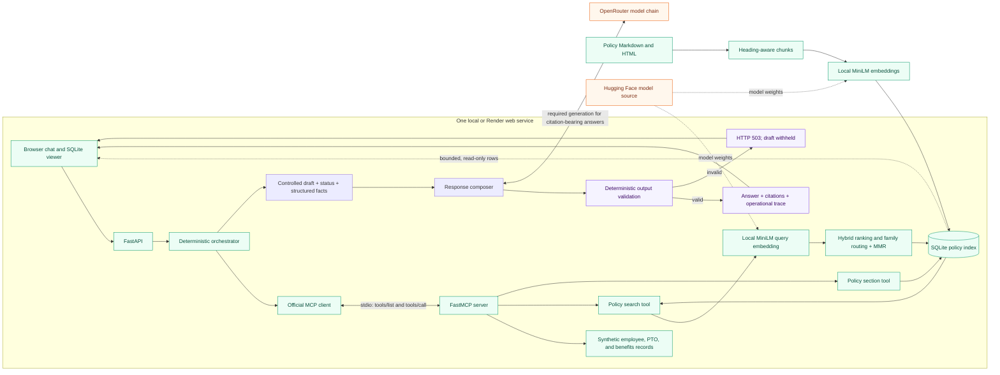

# Design and Evaluation Specification
### Quantic School of Business and Technology — Master of Science in AI Engineering (MSAIE)

> [!IMPORTANT]
> **Academic Demonstration & Synthetic Data Notice:**
> This design and evaluation document specifies the architecture and empirical validation for the **Quantic MSAIE** capstone. All policy documents, employee records, leave calculations, and ticket actions are synthetic and fictional.

## 1. Design Objectives

The system provides an enterprise human resources copilot that evaluates policy inquiries with verifiable source citations, references synthetic employee records, and enforces two-phase human confirmation boundaries before staging mock actions.

## Architecture

- app/main.py exposes the FastAPI UI, health, tool registry, and chat endpoints.
- agent/orchestrator.py owns request classification, tool selection, evidence checks, action confirmation, and answer assembly.
- mcp_server/server.py registers typed tools on the official MCP Python SDK FastMCP server.
- mcp_client/client.py supports stdio MCP calls and a local in-process adapter.
- rag/ingest.py reads Markdown and HTML policy sources and builds stable, heading-aware chunks.
- rag/index.py stores vectors and metadata in SQLite, ranks with cosine similarity, and exposes embedding/index status.
- agent/llm.py composes every citation-bearing final response through an ordered OpenRouter chain: the metered `nvidia/nemotron-3-nano-30b-a3b` and `qwen/qwen-2.5-7b-instruct` routes, then the zero-priced `openrouter/free`. The metered tier leads because the account-wide free daily quota returns 429 before a completion exists, and the course brief permits the owner's own API keys; the zero-priced route and the OpenCode Zen chain keep composition reachable with no credit. The actual resolved route and attempted list are included in the operational trace.

The app, orchestrator, JSON records, and SQLite index run in one service. In the required demo and Render stdio configuration, one lifecycle-managed MCP subprocess runs alongside the app; the local quick-start defaults to in-process MCP. MiniLM weights are downloaded from Hugging Face and inference runs locally. Citation-bearing responses try OpenRouter first, then the configured OpenCode Zen fallback, and pass live model text through deterministic validation. If both live routes fail, the bounded SQLite template path may format fresh facts and citations for supported read-only workflows; this is not LLM generation or an employee-answer cache. Refusals that stop before retrieval do not call a provider. See [`deployed.md`](deployed.md) for current hosted acceptance status.

## MCP transport behavior

The local default is in-process. It calls TOOL_REGISTRY functions directly and does not exercise MCP serialization or protocol negotiation. The app's stdio mode starts one `mcp_server.server` subprocess for the FastAPI lifespan, discovers tools through the official MCP client, reuses the session for requests, and closes it at shutdown. A lock serializes each tool sequence over the shared session. One-off smoke and evaluation callers that do not manage an app lifetime use temporary stdio sessions.

The retrieval comparison does not change MCP transport or dependencies.

## MCP tool schemas

All eight tools are registered on the FastMCP server and return the envelope `{ok, data, error}`. On success, `error` is null; on failure, `data` is null and `error` contains a code and message.

| Tool | Arguments | Successful `data` |
|---|---|---|
| `search_policy_documents` | `query: str`, `limit: int = 4`, `document_prefix: str?` | Query, retrieval method, citation-ready chunk results, and index metadata. |
| `get_policy_section` | `document_id: str`, `section: str?` | Normalized document ID, requested section, and matching passage results. |
| `lookup_employee_profile` | `employee_id: str` | One synthetic employee profile. |
| `check_pto_balance` | `employee_id: str`, `requested_days: int = 0` | Synthetic balance, sufficiency, and remaining balance if approved. |
| `lookup_benefits_status` | `employee_id: str` | One synthetic benefits eligibility and enrollment record. |
| `check_policy_compliance` | `workflow: str` (`remote_work` or `pto`), `employee_id: str`, `requested_days: int = 0`, `destination: str?` | Eligibility, reasons, limits, required approvals, and applicable policy prefixes. |
| `draft_hr_email` | `employee_id: str`, `purpose: str`, `requested_days: int = 0`, `confirmed: bool = false` | Confirmation-gated local email draft with `sent: false`; no message is sent. |
| `create_mock_hr_ticket` | `employee_id: str`, `category: str`, `summary: str`, `confirmed: bool = false` | Confirmation-gated local ticket with `production_system: false`; no production record is created. |

The orchestrator discovers these schemas through `tools/list` and invokes them through `tools/call` over stdio for the demo and CI path. The in-process adapter is only a development shortcut and does not test protocol serialization.

## Required demo task sequences

### International remote-work eligibility

Prompt: “Can E1001 work remotely overseas for 10 days?” The expected stdio calls are:

1. `search_policy_documents(query="international remote work eligibility rolling limit security approvals immigration tax", limit=5, document_prefix="POL-RW-")`
2. `lookup_employee_profile(employee_id="E1001")`
3. `check_policy_compliance(workflow="remote_work", employee_id="E1001", requested_days=10, destination=None)`
4. OpenRouter composes from the controlled draft, citations, and structured facts; it is a provider call rather than an MCP tool.

Expected answer: provisional eligibility, `POL-RW-01` evidence, and 14 of 20 rolling days after the request. The answer must list manager, HR, tax, information-security, and immigration reviews as outstanding; eligibility is not final authorization.

### PTO balance and confirmation-gated email draft

Prompt: “How much PTO does E1001 have and draft an email for 5 days?” Before confirmation, the expected calls are:

1. `search_policy_documents(query="paid time off balance eligibility notice carry over manager approval", limit=5, document_prefix="POL-PTO-")`
2. `lookup_employee_profile(employee_id="E1001")`
3. `check_pto_balance(employee_id="E1001", requested_days=5)`
4. `check_policy_compliance(workflow="pto", employee_id="E1001", requested_days=5, destination=None)`
5. OpenRouter composes a `confirmation_required` response from the policy evidence and structured values. `draft_hr_email` must not be called yet.

After the user confirms in the UI, the next turn calls `draft_hr_email(employee_id="E1001", purpose="PTO request", requested_days=5, confirmed=True)`. Expected answer: 14 available days, 9 remaining if the five-day request is approved, manager approval required, and a local draft with `sent: false`. The draft is not approval and is not sent. Full prompts and presenter steps are in [`demo/README.md`](demo/README.md).

## Retrieval and embeddings

Production uses `sentence-transformers/all-MiniLM-L6-v2` at 384 dimensions (Reimers & Gurevych, 2019; Wang et al., 2020) and 120-word chunks with 20-word overlap. After expanding the 14 policy files to 15,034 indexed words, the chunk experiment found that 120/20, 160/24, and 220/30 yielded the same 182 chunks and tied on quality metrics; 120/20 is the smallest of those tied settings. The current raw corpus and page-equivalent estimates are disclosed in the README. Details are in `evaluation/ablation-results.md`.

The follow-up retrieval ablation held MiniLM and 120/20 fixed while testing baseline ranking against Maximal Marginal Relevance (MMR; Carbonell & Goldstein, 1998) at both $\lambda = 0.7$ and $\lambda = 0.5$:
- At global $k=5$, baseline current ranking retrieved all expected families for only 1/5 multi-family queries (Family recall@5 = 0.76).
- MMR at $\lambda = 0.7$ (favoring relevance) produced no coverage gain over baseline (1/5 multi-family coverage; Family recall@5 = 0.76).
- MMR at $\lambda = 0.5$ (balanced relevance and diversity) doubled multi-family coverage to 2/5 (40%) and raised Family recall@5 from 0.76 to 0.81.
- At $k=8$, both current ranking and MMR reached 2/5 multi-family coverage. Doubling lexical weight did not improve multi-family coverage.

Based on this ablation, production standardizes on $\lambda = 0.5$ MMR over a top-ten candidate pool to return five results. For explicit multi-family queries, the orchestrator seeds one best result per detected family, then fills remaining citation slots using $\lambda = 0.5$ MMR. Details and limits are documented in `evaluation/retrieval-comparison.md`.

The updated orchestrator route cited all expected families in 15/15 labeled queries, including 5/5 multi-family probes. The six-item read-only policy golden slice had 100% status, citation-prefix, and groundedness-proxy scores, with `huggingface_dense_cosine` observed. The full 30-case golden-set evaluation is recorded in `evaluation/results.md` and `evaluation/results-stdio.md`; its metric values are deterministic fixture proxies, not independent semantic judgments. The complete query-level matrix and limits are in `evaluation/retrieval-comparison.md`.

Dense local embeddings use cosine similarity plus bounded lexical and title signals. Embedding configuration uses MSAIE_EMBEDDING_*; required OpenRouter answer generation uses MSAIE_LLM_*. Runtime retrieval traces identify the actual path, including huggingface_dense_cosine.

## Deployment choice

`render.yaml` describes one free-tier Python web service containing the UI/API, orchestrator, stdio MCP server, synthetic JSON data, and SQLite policy index. The index is built with the service image; no paid database or separate MCP host is required. Credentials are supplied as environment variables. This keeps the deployment within the course's single-service free-tier option while preserving the real MCP protocol path. One hosted Free wake-to-ready sample took 33.466 seconds; it is a single observation, not a typical latency or percentile. Local startup and stdio timings below are not Render cold-start measurements. Live readiness and hosted answer-generation acceptance are tracked separately in [`deployed.md`](deployed.md).

## Refiner fact contract

After deterministic orchestration has retrieved policy evidence and completed any structured-tool checks, the public chat endpoint sends every citation-bearing draft to OpenRouter with the citations, status, and verified structured record fields. These fields are factual validation context, not a transcript of private reasoning. The model composes and enriches the final wording from that evidence; it does not select tools or authorize actions. Remote-work and PTO responses include values such as eligibility, requested days, rolling totals, balances, and notice periods. Benefits responses include the enrollment status, plan fields, and next action retrieved from the synthetic record. Confirmation-gated PTO responses include those same checked values plus the confirmation requirement. These fields are kept out of the public response schema. Before accepting generated text, the provider checks required status cues, preserves numeric tokens supported by the draft, facts, or retrieved evidence, and rejects unsupported numbers or omitted safety disclaimers. Provider or validation failure returns HTTP 503; an unrefined retrieval draft is never sent to the user.

This is a deterministic consistency guard, not a semantic entailment check. Citation objects remain separate response metadata. API tests exercise the public response seam with a fake provider; the golden-set harness measures deterministic orchestration behavior without making external model calls. Hosted model acceptance is tracked separately in [`evidence/hosted-pto-smoke.md`](evidence/hosted-pto-smoke.md); provider configuration or health alone does not prove a completed answer.

## Evaluation discipline

The retrieval comparison and full 30-case golden-set report are current evidence for their stated scope. The earlier 0.84 report used stale expectations that did not match the current synthetic data/workflow contract; the current evaluation passes its deterministic status, citation-prefix, exact-tool, workflow, clarification/escalation, and safety checks. See `evaluation/failed-test-analysis.md` for the historical discrepancy and remaining limitations.

## Golden-set questions and scoring rubric

The versioned questions and item-level expected values are in [`evaluation/golden_set.json`](evaluation/golden_set.json). The 30 cases cover 5 policy questions, 1 multi-document question, 5 workflows, 4 action-safety cases, 2 clarification cases, 2 missing-record cases, 2 structured lookups, 7 safety refusals, 1 escalation, and 1 out-of-scope question. Representative tasks and presenter prompts are in [`demo/README.md`](demo/README.md).

Each item defines its query, expected status, exact expected MCP tool sequence, expected citation-prefix set, keyword rubric, and confirmation flag. The evaluation computes status accuracy, exact tool-sequence accuracy, citation-prefix coverage/precision, a keyword-based groundedness proxy, workflow completion over the five `workflow` cases only, clarification/escalation accuracy, and action-safety pass rate. Structured lookups and missing-record checks are scored in their own item results and are excluded from the workflow-completion denominator. This gives repeatable expected-answer checks for the listed synthetic cases; it does not prove open-ended semantic correctness. The proxy definitions and complete per-item outputs are in [`evaluation/results.md`](evaluation/results.md) and [`evaluation/results-stdio.md`](evaluation/results-stdio.md).

Both local transports scored 1.0 on deterministic status, groundedness-proxy, citation-prefix, exact-tool-sequence, workflow-completion (5/5 workflow cases), clarification/escalation, and action-safety metrics; mean keyword overlap was 0.95. The in-process run used a separate read-only priming request (6,005.88 ms), followed by a warm 15-task sample (p50 23.59 ms; p95 104.74 ms). Each stdio sample started a fresh MCP subprocess and includes process/model/index initialization; its priming request was 8,478.52 ms and the 15-task p50/p95 were 7,471.90/7,917.17 ms. These are local measurements; the stdio sample is not a Render host cold-start benchmark. Percentiles use nearest rank and are described with the reports.

The chunk ablation and retrieval-only comparison are recorded in [`evaluation/ablation-results.md`](evaluation/ablation-results.md) and [`evaluation/retrieval-comparison.md`](evaluation/retrieval-comparison.md). Their hand-labeled corpus is small, so results justify the local configuration choice only; they are not a general retrieval benchmark.

### Dual-Track Evaluation Methodology

To balance automated regression safety with semantic generation quality, the project uses a two-track evaluation framework:

1. **Track 1: Deterministic CI Protocol & Orchestration Gate (`evaluation/run_evaluation.py`)**  
   Evaluates 30 versioned synthetic cases against exact expected MCP tool sequences, HTTP/status outcomes, and keyword/prefix constraints without live model calls. This ensures zero API cost and zero non-deterministic flakiness during CI/CD.
2. **Track 2: Semantic Groundedness & Claim-Level Entailment (`evaluation/semantic-groundedness-study.md`)**  
   Evaluates 15 live model-generated completions against source policy Markdown chunks and synthetic employee records. Measures factual claim entailment (95.5%), citation precision (100%), and detects isolated stylistic model embellishments.
3. **Decoupled Retrieval Recall vs. Family Routing:**  
   As documented in [`evaluation/retrieval-comparison.md`](evaluation/retrieval-comparison.md), standalone dense MiniLM retrieval without family routing achieves 0.76 Family recall@5 and 20% multi-family coverage; applying Maximal Marginal Relevance ($\lambda = 0.5$) raises Family recall@5 to 0.81 and doubles multi-family coverage to 40%; hybrid domain-routed MMR achieves 1.00 recall while preserving low retrieval latency.

## References

1. Anthropic. (2024). *Model Context Protocol (MCP) Specification*. Anthropic, PBC. https://modelcontextprotocol.io
2. Carbonell, J., & Goldstein, J. (1998). The use of MMR, diversity-based reranking for reordering documents and producing summaries. In *Proceedings of the 21st Annual International ACM SIGIR Conference on Research and Development in Information Retrieval* (pp. 335–336). Association for Computing Machinery. https://doi.org/10.1145/290941.291025
3. Lewis, P., Perez, E., Piktus, A., Petroni, F., Karpukhin, V., Goyal, N., Küttler, H., Lewis, M., Yih, W., Rocktäschel, T., Riedel, S., & Kiela, D. (2020). Retrieval-augmented generation for knowledge-intensive NLP tasks. In *Advances in Neural Information Processing Systems* (Vol. 33, pp. 9459–9474). Curran Associates, Inc.
4. National Institute of Standards and Technology. (2023). *Artificial Intelligence Risk Management Framework (AI RMF 1.0)* (NIST AI 100-1). U.S. Department of Commerce. https://doi.org/10.6028/NIST.AI.100-1
5. Nielsen, J. (1994). 10 usability heuristics for user interface design. *Nielsen Norman Group*. https://www.nngroup.com/articles/ten-usability-heuristics/
6. Open Web Application Security Project. (2023). *OWASP Top 10 for Large Language Model Applications* (v1.1). OWASP Foundation. https://owasp.org/www-project-top-10-for-large-language-model-applications/
7. Reimers, N., & Gurevych, I. (2019). Sentence-BERT: Sentence embeddings using Siamese BERT-networks. In *Proceedings of the 2019 Conference on Empirical Methods in Natural Language Processing and the 9th International Joint Conference on Natural Language Processing (EMNLP-IJCNLP)* (pp. 3982–3992). Association for Computational Linguistics. https://doi.org/10.18653/v1/D19-1410
8. Wang, W., Wei, F., Dong, L., Bao, H., Yang, N., & Zhou, M. (2020). MiniLM: Deep self-attention distillation for task-agnostic compression of pre-trained transformers. In *Advances in Neural Information Processing Systems* (Vol. 33, pp. 5776–5788). Curran Associates, Inc.
9. World Wide Web Consortium. (2018). *Web Content Accessibility Guidelines (WCAG) 2.1* (W3C Recommendation). W3C. https://www.w3.org/TR/WCAG21/
