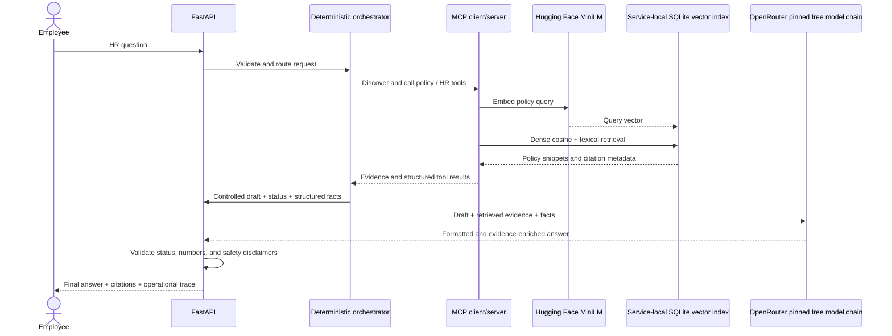

# Architecture

## Request lifecycle

The browser calls the FastAPI app in app/main.py. The application starts the SQLite policy index and discovers the configured tool set. In the required demo and Render stdio configuration, the FastAPI lifespan also starts one managed MCP process and reuses it for requests. The local quick-start defaults to in-process MCP. Each chat request is routed through agent/orchestrator.py, which chooses tools, checks structured results, retrieves policy evidence, applies safety and confirmation rules, and produces a controlled draft.

Every successful citation-bearing answer passes through the required OpenRouter response-generation step. The chain tries `qwen/qwen3.8-27b:free`, `nvidia/nemotron-3.5-lightning:free`, and `google/gemma-4-26b-a4b-it:free`, followed by `openrouter/free`. OpenRouter receives the controlled draft, retrieved policy text, and structured facts; citation metadata stays on the application response. The model formats and enriches the draft, but cannot select tools, change eligibility, or authorize an action. Deterministic checks preserve workflow status, supported numbers, and required safety language. They reject detectable process narration and truncated output; these checks are not semantic entailment judgments. If every route fails or returns invalid output, `/chat` returns HTTP 503 without exposing the draft. Requests refused before retrieval stop before the LLM.

`nvidia/nemotron-3.5-content-safety:free` is not an answer-generation fallback. OpenRouter describes it as a guardrail that classifies prompts and responses as safe or unsafe and emits safety labels; its output contract is moderation, not a grounded employee answer. If the project adds a model-based moderation pass, treat it as a separate safety stage and validate its labels at that boundary. See the [OpenRouter model page](https://openrouter.ai/nvidia/nemotron-3.5-content-safety:free).

## Modules

- app/: FastAPI endpoints and static employee workspace.
- agent/: request orchestration, response models, and required OpenRouter response composer.
- mcp_client/: transport selection and official MCP client calls.
- mcp_server/: FastMCP server and synthetic HR tools.
- rag/: Markdown/HTML ingestion, chunking, vector generation, SQLite storage, and ranking.
- policies/: fictional HR policy corpus.
- mock_data/: synthetic employee, PTO, benefits, office, and ticket records.

## MCP paths

The server registers eight typed tools on the MCP SDK FastMCP server.

- inprocess calls functions through TOOL_REGISTRY directly. It is the local default and does not validate MCP serialization or protocol behavior.
- stdio starts one `mcp_server.server` subprocess for the FastAPI app lifetime. The official MCP client initializes the session once, discovers tools, and reuses the session for chat requests. A lock serializes each orchestrated tool sequence over that shared session; app shutdown closes it. This keeps the MiniLM model resident and avoids creating another Python model process for every turn.
- Standalone smoke and evaluation callers that do not manage an app lifetime may still use a temporary stdio session.

If the persistent MCP connection fails, the current request returns an explicit MCP-unavailable result and updates cached MCP health. Routine `/health/ready` probes read that state without waiting on the session lock, so a long first model load cannot stall Render's health check. `/health?deep=true` performs explicit live discovery. Restart the service to create a fresh session after a failed stdio process. The first policy search after app start may load MiniLM in the long-lived MCP process; later turns reuse those model weights and SQLite connections. The app serializes MCP tool sequences while leaving answer generation outside that lock. The deployment record tracks whether this lifecycle fits the Render memory limit.

## Retrieval

rag/ingest.py extracts Markdown and HTML sections with document IDs, titles, headings, source paths, and page estimates. The selected chunk settings are 120 words with 20-word overlap. MiniLM is the only intended dense embedding model: sentence-transformers/all-MiniLM-L6-v2 at 384 dimensions. Embedding provider, base URL, key, and model use MSAIE_EMBEDDING_*; MSAIE_LLM_* configures the separate, required OpenRouter final-answer step.

At startup, policy files are chunked and their MiniLM embeddings are stored in the service's SQLite vector index. At request time, the policy tool embeds the query, applies hybrid lexical and dense ranking, and uses family routing with MMR to select citations. Current chunking, ranking settings, experiments, results, and limitations are recorded in [`evaluation/ablation-results.md`](../evaluation/ablation-results.md) and [`evaluation/retrieval-comparison.md`](../evaluation/retrieval-comparison.md); the chart is [`visuals/retrieval-comparison.svg`](../visuals/retrieval-comparison.svg).

`RagIndex.search(query, limit=k)` returns score-ranked candidates; `RagIndex.rerank_mmr` applies MMR using stored MiniLM vectors without exposing vectors to MCP callers. The orchestrator uses the same index to return at most five citations.

The evaluator lab reads document and chunk rows through `/api/index/documents` and `/api/index/documents/{document_id}/chunks`. These endpoints show citation metadata and complete text for a bounded preview, not vector payloads or the database filesystem path. The browser is a read-only view of the active SQLite index.

## Safety and generation

All records and actions are fictional. Prompt-injection checks, missing-data handling, policy evidence checks, and action confirmation remain deterministic. Requests referring to multiple synthetic employees are refused before MCP access; the guard recognizes roster names as well as explicit employee IDs. Requests to retrieve an individual's medical records or files are refused before employee lookup and point to the confidential HR channel. Mock email and ticket tools never send a message or create a production record.

The response composer checks eligibility, escalation, clarification, confirmation, and mock-action status cues; preserves supported numeric tokens and known no-action disclaimers; and rejects unsupported numbers or omitted numbers. Validation failure or provider outage fails closed with HTTP 503; the service never presents the unrefined policy draft as the final response. These string-level checks cannot prove semantic entailment; the full design is documented in design-and-evaluation.md.
