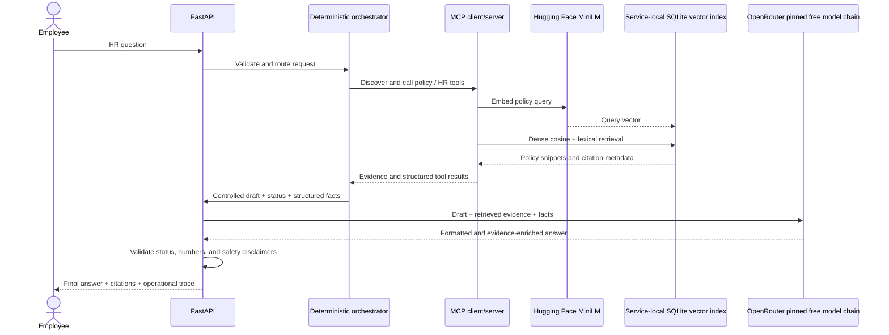

# Architecture

## Request lifecycle

The browser calls the FastAPI app in app/main.py. The application starts the SQLite policy index and discovers the configured tool set. Each chat request is routed through agent/orchestrator.py, which chooses tools, checks structured results, retrieves policy evidence, applies safety and confirmation rules, and produces a controlled draft.

Every result with policy citations then goes to the required OpenRouter response-generation step. The app tries `qwen/qwen3.8-27b:free`, `nvidia/nemotron-3.5-lightning:free`, and `google/gemma-4-26b-a4b-it:free` in order, with `openrouter/free` last. Each route gets one request capped at 12 seconds. OpenRouter receives the controlled draft, complete retrieved chunk text without document IDs, chunk IDs, titles, or source paths, structured status, and internal structured facts. Retrieval no longer cuts chunk text at an arbitrary character count. Citation metadata stays on the application response and is attached to the generated answer separately. OpenRouter formats the answer and may add details that directly answer the request; the prompt asks for concise, complete wording without repeated policy boilerplate. It cannot select tools, change eligibility, or authorize an action. Deterministic post-generation checks preserve status, uncertainty, supported numbers (including spelled-out values rendered as digits), and safety disclaimers. They reject common chain-of-thought markers, process narration, and provider completions marked as truncated before any model text can reach the user. This pattern-based guard is a fail-closed boundary for detectable leaks, not a semantic classifier. If one model returns invalid text, the next route is tried. If every route is unavailable or fails validation, `/chat` returns HTTP 503 and does not deliver the unrefined draft. The error response also exposes sanitized MCP and model-attempt metadata, never generated reasoning text. Requests refused before retrieval have no evidence to compose and stop before the LLM.

`nvidia/nemotron-3.5-content-safety:free` is not an answer-generation fallback. OpenRouter describes it as a guardrail that classifies prompts and responses as safe or unsafe and emits safety labels; its output contract is moderation, not a grounded employee answer. If the project adds a model-based moderation pass, treat it as a separate safety stage and validate its labels at that boundary. See the [OpenRouter model page](https://openrouter.ai/nvidia/nemotron-3.5-content-safety:free).

## Modules

- app/: FastAPI endpoints and static employee workspace.
- agent/: request orchestration, response models, and required OpenRouter response composer.
- mcp_client/: transport selection and official MCP client calls.
- mcp_server/: FastMCP server and synthetic HR tools.
- rag/: Markdown/HTML ingestion, chunking, vector generation, SQLite storage, and ranking.
- policies/: fictional HR policy corpus.
- mock_data/: synthetic employee, PTO, benefits, office, and ticket records.

## MCP paths

The server registers eight typed tools on the MCP SDK FastMCP server.

- inprocess calls functions through TOOL_REGISTRY directly. It is the local default and does not validate MCP serialization or protocol behavior.
- stdio starts mcp_server.server as a subprocess. The official MCP client initializes the session, discovers tools, and calls them over stdio.

## Retrieval

rag/ingest.py extracts Markdown and HTML sections with document IDs, titles, headings, source paths, and page estimates. The selected chunk settings are 120 words with 20-word overlap. MiniLM is the only intended dense embedding model: sentence-transformers/all-MiniLM-L6-v2 at 384 dimensions. Embedding provider, base URL, key, and model use MSAIE_EMBEDDING_*; MSAIE_LLM_* configures the separate, required OpenRouter final-answer step.

The chunk comparison selected 120/20 as the smallest setting among tied 120/20, 160/24, and 220/30 configurations. On the expanded corpus, global top-five MMR at λ=0.5 improved multi-family all-family coverage from 1/5 to 2/5 and family recall from 0.76 to 0.81. Production then searches up to three results per explicitly selected family, seeds one result from each, reranks the top ten with cosine MMR at λ=0.5, and returns five citations. This routed method covered all expected families in all five labeled multi-family queries. The comparison reports are in `evaluation/`; the chart is checked in at `visuals/retrieval-comparison.svg`.

rag/index.py computes dense cosine and adds bounded lexical-overlap, title-hit, and exact-phrase signals. If local embedding setup fails, the index records the error and uses a sparse hashing fallback. Each result and MCP trace reports runtime retrieval_method; the comparison confirmed huggingface_dense_cosine. When dense vectors are unavailable and the configured hashing fallback is active, reranking retains score order because sparse vectors are not used for MMR cosine diversity.

The updated orchestrator route cited all expected families in the five labeled multi-family probes and in the six-case read-only golden policy slice. It infers multiple policy families from explicit terms such as international work plus confidential data, expense plus approval, and leave or benefits plus records retention. Each intended family must return evidence above the existing 0.12 threshold or the request abstains. These are small, hand-labeled coverage proxies. See evaluation/retrieval-comparison.md for per-query results.

RagIndex.search(query, limit=k) returns score-ranked candidates; RagIndex.rerank_mmr applies MMR using stored MiniLM vectors without exposing vectors to MCP callers. The orchestrator uses the same persistent index to return at most five citations. Explicit regression behavior for non-positive k, empty queries, tied scores, zero vectors, and dimension changes remains open.

The evaluator lab reads document and chunk rows through `/api/index/documents` and `/api/index/documents/{document_id}/chunks`. These endpoints show citation metadata and complete text for a bounded preview, not vector payloads or the database filesystem path. The browser is a read-only view of the active SQLite index.

## Safety and generation

All records and actions are fictional. Prompt-injection checks, missing-data handling, policy evidence checks, and action confirmation remain deterministic. Requests referring to multiple synthetic employees are refused before MCP access; the guard recognizes roster names as well as explicit employee IDs. Requests to retrieve an individual's medical records or files are refused before employee lookup and point to the confidential HR channel. Mock email and ticket tools never send a message or create a production record.

The response composer checks eligibility, escalation, clarification, confirmation, and mock-action status cues; preserves supported numeric tokens and known no-action disclaimers; and rejects unsupported numbers or omitted numbers. Validation failure or provider outage fails closed with HTTP 503; the service never presents the unrefined policy draft as the final response. These string-level checks cannot prove semantic entailment; the full design is documented in design-and-evaluation.md.
