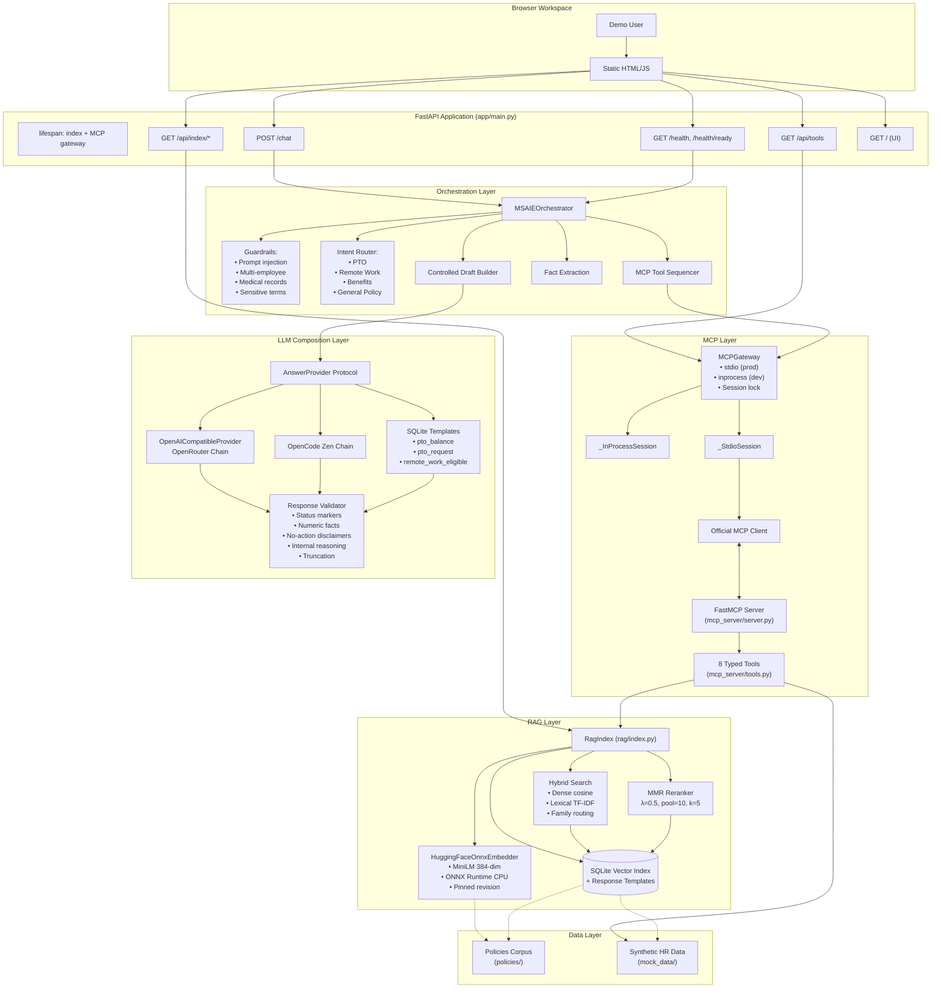
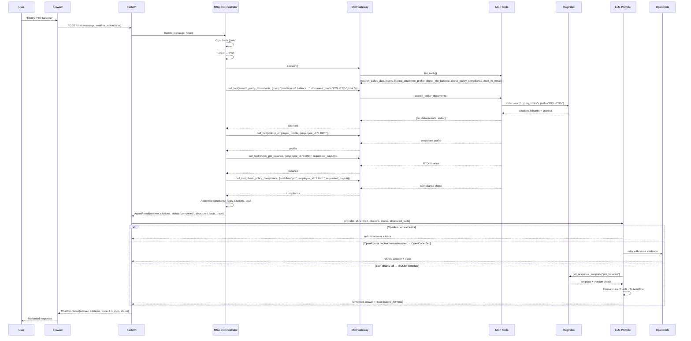
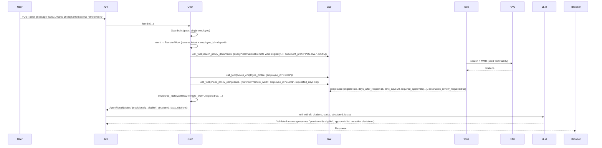
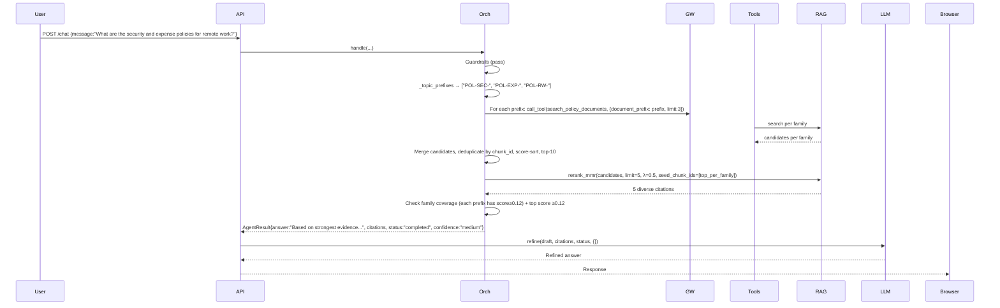
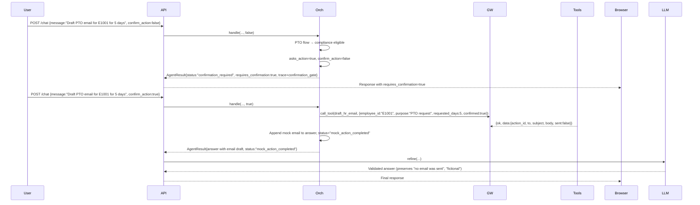

# MSAIE HR Agent — Architecture

For a source-grounded assessment of proposed module deepening, rubric impact, and the recommended post-acceptance sequence, see [Architecture Deepening Review](architecture-deepening-review.md).

## 1. System Overview

The MSAIE HR Agent is a synthetic HR support assistant that combines:
- **Local policy retrieval** via a SQLite vector index (MiniLM embeddings, 384 dimensions)
- **Structured HR tools** via the Model Context Protocol (MCP) over stdio
- **Controlled LLM answer composition** via OpenRouter (primary) → OpenCode Zen (fallback) → build-seeded SQLite templates (bounded read-only fallback)

All data is synthetic; no production HR systems are accessed. The system enforces deterministic guardrails, confirmation-gated mock actions, and fail-closed behavior when live generation is unavailable or unsafe.

---

## 2. Architectural Style

**Layered architecture with RAG + MCP + deterministic orchestration.**

```
┌─────────────────────────────────────────────────────────────────────────────┐
│                           PRESENTATION LAYER                                │
│  Browser workspace (static HTML/JS) ──► FastAPI /chat, /health, /api/*     │
└─────────────────────────────────────────────────────────────────────────────┘
                                    │
                                    ▼
┌─────────────────────────────────────────────────────────────────────────────┐
│                         APPLICATION / ORCHESTRATION LAYER                   │
│  MSAIEOrchestrator (agent/orchestrator.py)                                  │
│  • Request validation & guardrails (prompt injection, multi-employee,       │
│    medical records, sensitive terms)                                        │
│  • Intent routing (PTO, remote work, benefits, general policy)              │
│  • MCP tool sequencing (search, lookup, compliance, mock actions)           │
│  • Structured fact extraction & citation assembly                           │
│  • Controlled draft construction                                            │
└─────────────────────────────────────────────────────────────────────────────┘
                                    │
                ┌───────────────────┼───────────────────┐
                ▼                   ▼                   ▼
┌─────────────────────┐ ┌─────────────────────┐ ┌─────────────────────┐
│   MCP GATEWAY       │ │   RAG INDEX         │ │   LLM PROVIDER      │
│   (mcp_client)      │ │   (rag/index.py)    │ │   (agent/llm.py)    │
│                     │ │                     │ │                     │
│ • stdio (prod/CI)   │ │ • SQLite vec index  │ │ • OpenRouter chain  │
│ • inprocess (dev)   │ │ • Hybrid search     │ │ • OpenCode Zen      │
│ • Session lifecycle │ │ • Family routing    │ │ • SQLite templates  │
│ • Tool registry     │ │ • MMR reranking     │ │ • Validation        │
└─────────────────────┘ └─────────────────────┘ └─────────────────────┘
                │                   │                   │
                ▼                   ▼                   ▼
┌─────────────────────────────────────────────────────────────────────────────┐
│                           DATA / TOOL LAYER                                 │
│  ┌─────────────────┐  ┌─────────────────┐  ┌─────────────────────────────┐ │
│  │ MCP SERVER      │  │ POLICY CORPUS   │  │ SYNTHETIC HR RECORDS        │ │
│  │ (mcp_server/)   │  │ (policies/)     │  │ (mock_data/)                │ │
│  │                 │  │                 │  │                             │ │
│  │ 8 typed tools:  │  │ • 8 policy files│  │ • employees.json            │ │
│  │ • search_policy │  │ • Markdown/HTML │  │ • pto_balances.json         │ │
│  │ • get_section   │  │ • Section-aware │  │ • benefits.json             │ │
│  │ • lookup_emp    │  │   chunking      │  │ • (no tickets/email sent)   │ │
│  │ • check_pto     │  │ • 120w/20w overlap    │ │                        │ │
│  │ • lookup_benefits│  │ • MiniLM ONNX   │  │                             │ │
│  │ • check_compliance│ │   embeddings    │  │                             │ │
│  │ • draft_email   │  │ • SQLite storage│  │                             │ │
│  │ • create_ticket │  │                 │  │                             │ │
│  └─────────────────┘  └─────────────────┘  └─────────────────────────────┘ │
└─────────────────────────────────────────────────────────────────────────────┘
```

---

## 3. Module Map & Public Interfaces

| Module | Path | Public Interface | Responsibility |
|--------|------|------------------|----------------|
| **FastAPI App** | `app/main.py` | `app` (FastAPI), `lifespan`, `/chat`, `/health`, `/health/ready`, `/api/tools`, `/api/index/*` | HTTP server, request routing, health, static UI |
| **Orchestrator** | `agent/orchestrator.py` | `MSAIEOrchestrator.handle(message, confirm_action) -> AgentResult` | Guardrails, intent routing, MCP tool calls, draft assembly |
| **LLM Provider** | `agent/llm.py` | `get_provider() -> AnswerProvider`, `provider_status()`, `build_grounding_prompt()`, `_refinement_issue()` | OpenRouter → OpenCode Zen → SQLite template chain; validation |
| **LLM Routes** | `agent/llm_routes.py` | `OPENROUTER_MODEL_CHAIN`, `OPENCODE_ZEN_MODELS`, `OPENCODE_ZEN_FREE_MODEL_ALLOWLIST` | Model allowlists & endpoints |
| **Models** | `agent/models.py` | `AgentResult` (dataclass) | Structured orchestrator output |
| **Response Cache** | `agent/response_cache.py` | `cached_response(index, result) -> (answer, metadata) | None`, `RESPONSE_TEMPLATES` | Build-seeded SQLite template fallback for read-only PTO/remote-work |
| **MCP Gateway** | `mcp_client/client.py` | `MCPGateway(transport)`, `.start()`, `.close()`, `.session()`, `.discover()` | Transport abstraction (stdio/inprocess), session lifecycle, locking |
| **MCP Server** | `mcp_server/server.py` | `mcp` (FastMCP instance) | Registers 8 tools via `@mcp.tool()` |
| **MCP Tools** | `mcp_server/tools.py` | 8 functions: `search_policy_documents`, `get_policy_section`, `lookup_employee_profile`, `check_pto_balance`, `lookup_benefits_status`, `check_policy_compliance`, `draft_hr_email`, `create_mock_hr_ticket` | Synthetic HR tool implementations |
| **RAG Index** | `rag/index.py` | `RagIndex` class: `build()`, `ensure()`, `search()`, `rerank_mmr()`, `get_section()`, `list_documents()`, `get_chunks()`, `get_response_template()`, `list_response_templates()`, `stats()` | SQLite vector index, hybrid retrieval, MMR, template storage |
| **Ingestion** | `rag/ingest.py` | `load_policy_sections()`, `chunk_sections()`, `load_markdown()`, `load_html()` | Policy parsing, section-aware chunking (120w/20w) |

---

## 4. Component Diagram (Mermaid)



---

## 5. Data Flow — Primary Use Cases

### 5.1 PTO Balance / Request Flow



### 5.2 International Remote Work Eligibility Flow



### 5.3 General Policy Question Flow (Multi-family)



### 5.4 Confirmation-Gated Mock Action Flow



---

## 6. Key Design Decisions (ADR References)

| ADR | Decision | Impact |
|-----|----------|--------|
| [0001](adr/0001-controlled-orchestration.md) | Deterministic orchestration owns tool selection, eligibility, confirmation | LLMs never choose tools or authorize actions |
| [0002](adr/0002-retrieval-baseline.md) | MiniLM 384-dim, 120w/20w chunks, hybrid search, family routing, MMR λ=0.5, pool=10, k=5 | Fixed retrieval baseline; experiments in evaluation/ |
| [0003](adr/0003-mcp-transport.md) | stdio required for demo/CI; inprocess for local dev | Keeps MiniLM resident in MCP process |
| [0004](adr/0004-synthetic-data-and-action-boundary.md) | All data synthetic; mock actions confirmation-gated; no production contact | Safety boundary; demo-safe |
| [0005](adr/0005-gated-render-deployment.md) | CI-gated Render deploy; health checks require pinned index + OpenRouter + MCP | Deploy-time verification |
| [0006](adr/0006-ci-gated-render-deploy-hook.md) | Render deploy hook gated on CI pass | Prevents broken deploys |
| [0007](adr/0007-lifecycle-managed-mcp-stdio.md) | Single persistent MCP stdio process per app lifetime; lock serializes tool calls | Avoids per-request model reload; keeps memory bounded |
| [0008](adr/0008-openrouter-quota-aware-fallback.md) | Account-wide free quota 429 → immediate OpenCode Zen; other 429s exhaust chain first | Cost control; graceful degradation |
| [0009](adr/0009-memory-bounded-huggingface-embeddings.md) | ONNX INT8 MiniLM, CPU only, pinned revision, tokenizer max 256 tokens | Predictable memory; no GPU dependency |
| [0010](adr/0010-provider-and-sqlite-response-fallbacks.md) | SQLite templates only for supported read-only PTO/remote-work; fresh facts + citations required; fail-closed otherwise | Bounded fallback scope; no stale employee answers |

---

## 7. Retrieval Architecture

### 7.1 Index Build (`RagIndex.build()`)
1. **Load policies** → `load_policy_sections()` parses Markdown (frontmatter + headings) & HTML (meta tags + headings)
2. **Chunk** → `chunk_sections()`: 120-word windows, 20-word overlap, chunk_id = `{doc_id}:{section_slug}:{ordinal}`
3. **Embed** → Priority: remote (OpenRouter) → local (MiniLM ONNX) → sparse hashing fallback
4. **Store** → SQLite with tables: `metadata`, `chunks` (vector_json), `response_templates`
5. **Signature** → `embedding_config_signature()` + `policy_source_fingerprint()` + template version/signature → rebuild trigger

### 7.2 Query-Time Retrieval (`RagIndex.search()`)
- **Vector format**: dense (MiniLM) or sparse (hashing TF-IDF fallback)
- **Query embedding**: same pipeline as build (remote/local/sparse)
- **Candidate selection**:
  - Lexical filter (sparse: require token overlap; dense: no filter)
  - Score = dense_cosine + lexical_ratio×0.08 + title_section_hits×0.025 + phrase_bonus×0.08
  - Document prefix filter (family routing)
  - Return top-k (default 4, max 10)

### 7.3 MMR Reranking (`RagIndex.rerank_mmr()`)
- Input: score-sorted candidates (max 10)
- Seed chunks from required families (family coverage guarantee)
- Relevance = normalized score; Redundancy = max cosine with chosen
- MMR score = λ×relevance − (1−λ)×redundancy (λ=0.5)
- Output: up to 5 citations

### 7.4 Orchestrator Retrieval Policy
| Query Type | Prefix Strategy | Pool | MMR | Final k |
|------------|-----------------|------|-----|---------|
| Single-family (PTO, RW, Benefits) | One prefix, limit=5 | 5 | No (orchestrator takes top-5) | ≤5 |
| Multi-family | Multiple prefixes, limit=3 each | ≤10 | Yes (λ=0.5, seeds from each family) | 5 |
| General | No prefix, limit=10 | 10 | No | ≤5 |

---

## 8. LLM Composition & Fallback Chain

### 8.1 OpenRouter Primary Chain
```
nvidia/nemotron-3-nano-30b-a3b → qwen/qwen-2.5-7b-instruct → openrouter/free
```
- The first two routes are metered. The project brief permits the owner's own API keys, and a
  credit-backed first route removes the account-wide free-daily-quota 429 that otherwise stops
  composition before any completion exists. Both are general-purpose composers; safeguard-tuned
  models are excluded because they hedge and the answer validator requires binding status language.
- `openrouter/free` is retained last so a live answer stays reachable with no credit. Composition
  still does not *depend* on credit: the OpenCode Zen chain and the build-seeded SQLite templates
  sit after this provider.
- Temperature: 0.0
- Timeout: 15s (configurable, max 15s)
- System prompt: Constrained final-answer composer (no tool choice, no citations in output, no reasoning exposure)

### 8.2 OpenCode Zen Fallback Chain
```
nemotron-3.5-lightning-free → big-pickle → space-bunny-free
```
- Configurable via `OPENCODE_ZEN_MODELS` (validated against `OPENCODE_ZEN_FREE_MODEL_ALLOWLIST`)
- Endpoint: `https://opencode.ai/zen/v1` (validated)
- Timeout: 8s (configurable, max 8s)
- Activated after: OpenRouter chain exhausted OR account-wide free quota 429 detected

### 8.3 SQLite Template Fallback
- **Templates** (build-seeded, versioned):
  - `pto_balance`: balance + notice days (no request)
  - `pto_request`: balance + requested + remaining_if_approved + notice days
  - `remote_work_eligible`: provisional eligibility + rolling total + required approvals + destination review
- **Activation conditions**:
  1. Both live chains failed (validation rejection or unavailable)
  2. `result.citations` non-empty
  3. `result.requires_confirmation == false`
  4. `result.status` ∈ {completed, provisionally_eligible}
  5. Workflow = PTO (eligible + requested_days>0 → pto_request; else pto_balance) OR Remote Work (eligible)
  6. Current citations include at least one chunk from template's `document_prefix` with non-empty snippet
  7. All `required_facts` present, valid, and bounded (employee_id format, name length, numbers 0-365, approvals from allowlist)
- **Trace**: `response_mode: "sqlite_template"`, `cache_hit: true`, `template_key`, `template_version`

### 8.4 Response Validation (`_refinement_issue()`)
Checks applied to **every** model output (OpenRouter, OpenCode, Template):
| Check | Failure → |
|-------|-----------|
| Empty output | `empty_refinement` |
| Status marker missing (e.g., "provisionally eligible") | `status_marker_missing` |
| Status contradiction (e.g., claims approval when not_eligible) | `status_contradiction` |
| Internal reasoning exposed (chain-of-thought markers) | `internal_reasoning_exposed` |
| No-action disclaimer omitted ("no email was sent", "no production system contacted") | `no_action_disclaimer_omitted` |
| Unsupported numeric fact (number not in draft/facts/evidence) | `unsupported_numeric_fact` |
| Required numeric fact omitted | `numeric_fact_omitted` |
| Truncated (finish_reason=length or ends with …) | `truncated_response` |
| Malformed provider response | `malformed_provider_response` |

**Fail-closed**: Any validation failure → HTTP 503, controlled draft withheld, trace records failure scope.

---

## 9. Safety & Guardrails (Deterministic, Pre-Retrieval)

| Guardrail | Trigger | Response | MCP Called? |
|-----------|---------|----------|-------------|
| Empty message | `message.strip() == ""` | Clarification required | No |
| Prompt injection | Patterns: ignore/disregard/override + instructions/rules/safeguards/policy; reveal/show/print + system prompt/hidden/private/confidential/secrets; bypass/disable/evade + safeguards/controls/policy/restrictions | Refusal + trace `prompt_injection_refused` | No |
| Multiple employee IDs | >1 E#### pattern OR roster name match | Refusal + trace `multiple_employee_ids_refused` | No |
| Medical records request | Patterns: medical/health/clinical + records/files/documents/charts/summaries/details/history/diagnosis/notes; show me medical; diagnosis | Refusal + trace `medical_record_request_refused` | No |
| Sensitive terms | harassment, discrimination, retaliation, legal advice, lawsuit, assault, medical diagnosis, suicide, self-harm, investigate my manager | Policy search (POL-CON-) + escalation flow; ticket creation requires confirmation | Yes (policy search only) |

---

## 10. MCP Transport Modes

| Mode | Use Case | Session | MiniLM Loading |
|------|----------|---------|----------------|
| `stdio` (default) | Demo, Render, CI, evaluation | One persistent process per app lifetime; `AsyncExitStack` + lock serializes tool sequences | Loaded once in MCP process; reused across requests |
| `inprocess` | Local quick-start | Direct function calls via `TOOL_REGISTRY` | Loaded in API process per request (no persistence) |

**Health checks**:
- `/health` (shallow): reads cached MCP status, index stats, LLM config
- `/health/ready`: requires `pinned_index_ready == true` AND `llm_provider.status == "configured"` AND `mcp.status == "available"`
- `/health?deep=true`: forces live MCP tool discovery

---

## 11. Configuration & Environment

| Setting | Purpose | Default |
|---------|---------|---------|
| `MSAIE_MCP_TRANSPORT` | MCP transport mode | `stdio` |
| `MSAIE_LLM_BASE_URL` | OpenRouter endpoint | `https://openrouter.ai/api/v1` |
| `MSAIE_LLM_API_KEY` | OpenRouter API key | *(required)* |
| `MSAIE_LLM_FALLBACK_MODEL` | Final OpenRouter model | `openrouter/free` |
| `MSAIE_LLM_TIMEOUT_SECONDS` | OpenRouter request timeout | `12` (max 12) |
| `OPENCODE_API_KEY` | OpenCode Zen API key | *(optional)* |
| `OPENCODE_ZEN_BASE_URL` | OpenCode Zen endpoint | `https://opencode.ai/zen/v1` |
| `OPENCODE_ZEN_MODELS` | OpenCode model chain (csv) | `nemotron-3.5-lightning-free,big-pickle,space-bunny-free` |
| `OPENCODE_ZEN_TIMEOUT_SECONDS` | OpenCode request timeout | `8` (max 8) |
| `MSAIE_EMBEDDING_PROVIDER` | Embedding provider | `huggingface` |
| `MSAIE_EMBEDDING_BASE_URL` | Remote embedding endpoint | *(optional)* |
| `MSAIE_EMBEDDING_API_KEY` | Remote embedding API key | *(optional)* |
| `MSAIE_EMBEDDING_MODEL` | Embedding model name | `sentence-transformers/all-MiniLM-L6-v2` |
| `MSAIE_EMBEDDING_REVISION` | HF revision (local) | `1110a243fdf4706b3f48f1d95db1a4f5529b4d41` |
| `MSAIE_EMBEDDING_BATCH_SIZE` | Remote embedding batch | `32` (max 64) |
| `MSAIE_EMBEDDING_TIMEOUT_SECONDS` | Remote embedding timeout | `120` |
| `MSAIE_INDEX_PATH` | SQLite index path | `/tmp/msaie-rag/rag_index.sqlite3` |
| `MSAIE_ACTION_LOG` | Mock action log path | `/tmp/msaie-mock-actions.jsonl` |
| `MSAIE_PUBLIC_URL` | HTTP-Referer for providers | *(optional)* |

**Embedding settings are separate from LLM settings** (`MSAIE_EMBEDDING_*` vs `MSAIE_LLM_*`).

---

## 12. API Contracts

### 12.1 POST /chat
**Request**:
```json
{ "message": "string (1-4000 chars)", "confirm_action": "boolean (default false)" }
```

**Response (ChatResponse)**:
```json
{
  "answer": "string",
  "citations": [{"chunk_id": "str", "document_id": "str", "title": "str", "section": "str", "source_path": "str", "retrieval_method": "str", "snippet": "str", "score": "float"}],
  "supporting_snippets": ["string"],
  "trace": [{"step": "int", "event": "str", ...}],
  "status": "completed|provisionally_eligible|not_eligible|confirmation_required|clarification_required|refused|escalated|insufficient_evidence|mcp_unavailable|tool_error|not_found|llm_unavailable",
  "requires_confirmation": "boolean",
  "confidence": "high|medium|low",
  "mcp": {"status": "available|unavailable|not_called", "transport": "stdio|inprocess", "tool_count": "int", "error?": "str"},
  "llm": {"provider": {...}, "refinement": {"status": "completed|rejected|unavailable|not_configured|cached_template", "provider": "str", "model": "str|null", "attempted_models": ["str"], "model_attempts": [{}], "attempts": "int", ...}}
}
```

### 12.2 GET /health
Returns aggregated status of index, MCP, LLM provider.

### 12.3 GET /api/index/documents
Read-only index preview: document list, chunk counts, template metadata (no vectors).

---

## 13. Architectural Technical Debt & Known Limitations

| Area | Debt / Limitation | Mitigation / Tracking |
|------|-------------------|----------------------|
| **MCP Process Memory** | Render sampled 275MB/536MB after first query; historical PyTorch samples near limit; one unexplained restart during model load | Monitor hosted memory; consider model offloading or process recycling (ADR-0007) |
| **Validation is Syntactic** | `_refinement_issue()` uses regex/token checks, not semantic entailment; cannot prove answer correctness | Documented in `design-and-evaluation.md`; golden-set eval measures control-flow proxies only |
| **SQLite Vector Scalability** | Single-file SQLite with all vectors in `vector_json` TEXT; no ANN index; linear scan on search | Corpus is small (8 policies, ~200 chunks); acceptable for demo scope |
| **Sparse Fallback Quality** | Hashing TF-IDF fallback has no semantic understanding; used only when MiniLM fails to load | Readiness gate requires `semantic_embeddings=true`; fallback only for build-time resilience |
| **OpenCode Zen Model Volatility** | Free model catalog changes; `OPENCODE_ZEN_FREE_MODEL_ALLOWLIST` pinned in code; requires code review to update | ADR-0008; environment can only reorder/select subset |
| **No Conversation Memory** | Each `/chat` request is independent; no session context | By design for synthetic demo; would need explicit architecture change |
| **Single-Tenant Synthetic Data** | `mock_data/` is static; no multi-tenancy, no auth, no real employee lookup | Documented in README; demo-only |
| **Template Coverage** | Only 3 templates (PTO balance, PTO request, RW eligible); no templates for benefits, expenses, equipment, etc. | Intentional: bounded fallback scope per ADR-0010 |
| **Tokenizer Truncation** | Fixed 256-token limit for MiniLM; long policy sections truncated | Chunk size (120 words) keeps most chunks under limit |
| **No Streaming** | Full response buffered; no SSE/streaming for LLM output | Simpler validation; could add for UX |
| **CI Coverage Gaps** | Golden-set eval measures orchestrator behavior, not LLM generation quality; no independent semantic judging | Documented in `evaluation/`; human review in `reviews/` |

---

## 14. Deployment Topology

```
┌────────────────────────────────────────────────────────────────┐
│                        RENDER SERVICE                          │
│  ┌──────────────────────────────────────────────────────────┐  │
│  │ FastAPI Process (Python 3.12)                            │  │
│  │  • app/main.py                                           │  │
│  │  • agent/orchestrator.py                                 │  │
│  │  • agent/llm.py (OpenRouter client)                      │  │
│  │  • rag/index.py (read-only SQLite)                       │  │
│  │  • mcp_client/client.py (MCPGateway)                     │  │
│  └──────────────────────────────────────────────────────────┘  │
│                              │                                 │
│                              ▼                                 │
│  ┌──────────────────────────────────────────────────────────┐  │
│  │ MCP Stdio Subprocess (python -m mcp_server.server)       │  │
│  │  • mcp_server/server.py (FastMCP)                        │  │
│  │  • mcp_server/tools.py (8 tools)                         │  │
│  │  • rag/index.py (RagIndex + HuggingFaceOnnxEmbedder)     │  │
│  │  • ONNX Runtime + MiniLM INT8 model (resident)           │  │
│  │  • SQLite index (read/write during build; read at runtime)│ │
│  └──────────────────────────────────────────────────────────┘  │
│                              │                                 │
│              ┌───────────────┼───────────────┐                 │
│              ▼               ▼               ▼                 │
│       OpenRouter API    OpenCode Zen API   (local only)       │
│       (HTTPS)           (HTTPS)                               │
└────────────────────────────────────────────────────────────────┘
```

---

## 15. Observability & Tracing

Every `/chat` response includes a `trace` array with ordered events:
1. `discover_tools` — MCP tool list
2. `tool_call` — each MCP invocation (tool, arguments, result summary, status)
3. `confirmation_gate` — when confirmation required
4. `llm_refinement` — provider, model, attempted_models, model_attempts, validation outcome, failure_scope, cache_hit

**Health endpoints** expose:
- Index: `semantic_embeddings`, `embedding_model`, `embedding_backend`, `embedding_revision`, `dimensions`, `chunk_words`, `overlap_words`, `documents`, `chunks`
- MCP: `status`, `transport`, `tools`, `error?`
- LLM: `status`, `type`, `model_chain`, `fallback_provider`, `configuration_issue?`

---

## 16. Testing & Verification

| Test Target | Location | Scope |
|-------------|----------|-------|
| Unit: RAG search/MMR | `tests/test_rag.py` | `RagIndex.search`, `rerank_mmr`, build/load |
| Unit: Orchestrator | `tests/test_app.py` | Guardrails, intent routing, tool sequencing |
| Unit: MCP | `tests/test_mcp.py` | Gateway, stdio/inprocess, tool registry |
| Unit: LLM Validation | `tests/test_llm.py` | `_refinement_issue`, provider status, prompt building |
| Integration: Evaluation | `evaluation/run_evaluation.py` | Golden-set orchestrator behavior (inprocess + stdio) |
| Retrieval Comparison | `evaluation/run_retrieval_comparison.py` | Hit@k, family recall, diversity, route behavior |
| Ablation | `evaluation/run_ablation.py` | Chunk size, overlap, ranking weights |
| Smoke: MCP | `scripts/smoke_mcp.py` | End-to-end stdio tool calls |
| Smoke: Hosted | `scripts/smoke_hosted_demo.py` | Live `/chat` against Render (optional) |

**Verification commands**:
```bash
python -m compileall -q app agent rag mcp_server mcp_client evaluation scripts
python -m pytest -q
python -m evaluation.run_evaluation --transport inprocess
python -m evaluation.run_evaluation --transport stdio
python scripts/smoke_mcp.py
```

---

## 17. Related Documents

| Document | Purpose |
|----------|---------|
| `design-and-evaluation.md` | Full design rationale, evaluation methodology, limitations |
| `evaluation/retrieval-comparison.md` | Retrieval experiment results (top-k, MMR, family routing) |
| `evaluation/ablation-results.md` | Chunk/overlap/weight ablation study |
| `docs/adr/` | Architecture Decision Records (0001–0010) |
| `docs/security-control-map.md` | Security boundaries, residual risks |
| `docs/traceability-matrix.md` | Requirements → implementation traceability |
| `deployed.md` | Live deployment status & acceptance evidence |
| `specs/system-requirements.md` | System requirements specification |

---

*Generated from source code analysis. Keep in sync with implementation changes.*
