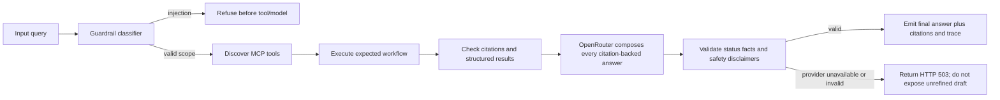

# Grader UX and Validation

The interface is designed for inspection, not merely demonstration. A grader can run the two required tasks, select adversarial cases, inspect citations, and expand the MCP/LLM trace without accessing secrets.

## Automated validator contract

The validator should assert:

- `/health` is operational.
- MCP discovery returns the expected typed tools.
- Required workflows use the expected tool sequence.
- Citation IDs match the evidence returned by policy search.
- Confirmation is required for write-like mock actions.
- Injection refusals that stop before retrieval do not call tools or the LLM.
- Every citation-bearing response calls OpenRouter, including clarification and confirmation responses grounded in retrieved policy.
- Missing inputs request clarification, unknown records return an explicit `not_found` result, and sensitive cases escalate; the agent does not invent records.
- Missing provider configuration, provider errors, or invalid generated text fail closed with HTTP 503 instead of returning the controlled retrieval draft.

## Nielsen heuristic review

| Heuristic | Review question |
|---|---|
| Visibility of system status | Does the UI show loading, status, MCP, citations, and trace state? |
| Match to real-world language | Are policy, employee, approval, and escalation terms clear? |
| User control | Can the user stop before a mock action and confirm explicitly? |
| Consistency | Are statuses, citations, and action labels used consistently? |
| Error prevention | Are missing IDs, missing days, injection, and unsafe actions handled before execution? |
| Recognition over recall | Are examples, citations, and tool names visible in the response? |
| Flexibility | Can a grader use presets or type a custom query? |
| Minimalist design | Is evidence shown without decorative noise or unsupported claims? |
| Error recovery | Do errors explain the next safe step? |
| Help and documentation | Are architecture, limitations, and reproduction commands linked in the repository? |

## Accessibility checks

Use keyboard navigation, visible focus, semantic labels, live status announcements, sufficient contrast, responsive reflow, and controls large enough for touch. A local browser review was performed against the updated checkout; its scope and limitations are recorded in [`evidence/ui-review.md`](../evidence/ui-review.md). It does not substitute for screen-reader or automated contrast testing, nor does it claim validation of a deployed interface.
