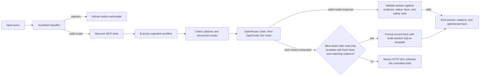

# Grader UX and Validation

The interface is designed for inspection, not merely demonstration. A grader can run the two required tasks, select adversarial cases, inspect citations, and expand the MCP/LLM trace without accessing secrets.

## Automated validator contract

The validator should assert:

- `/health` is operational.
- MCP discovery returns the expected typed tools.
- Required workflows use the expected tool sequence.
- Citation IDs match the evidence returned by policy search.
- Confirmation is required for write-like mock actions.
- Injection refusals that stop before retrieval do not call tools or the LLM.
- Every citation-bearing response attempts the configured model path: OpenRouter first, followed by OpenCode Zen. An identifiable account-wide OpenRouter free-quota 429 skips the remaining OpenRouter routes; other failures exhaust the OpenRouter chain before OpenCode.
- The main chat shows four complete fictional sample questions with synthetic employee IDs. Selecting one fills the composer; it does not submit the request.
- The single Evaluator & Test Lab entry point retains nine scenarios, each with stable `data-lab-load` and `data-lab-run` controls. Load fills without sending; Run now submits to the live service, and mock actions still require the explicit confirmation gate.
- Each model candidate passes the same answer validator. Invalid, truncated, or unavailable candidates advance through the remaining configured routes.
- If both live provider chains fail, only a supported read-only PTO or provisionally eligible remote-work workflow with fresh matching structured facts and policy citations may use its versioned SQLite template. The trace labels this `cached_template`; this formats current facts and is not a stored answer.
- Missing inputs request clarification, unknown records return an explicit `not_found` result, and sensitive cases escalate; the agent does not invent records.
- Unsupported questions, confirmation-gated actions, unsafe cases, and template misses fail closed with HTTP 503 if model generation is unavailable. No unrefined controlled draft is returned.

## Nielsen heuristic review

| Heuristic | Review question |
|---|---|
| Visibility of system status | Does the UI show loading, status, MCP, citations, and trace state? |
| Match to real-world language | Are policy, employee, approval, and escalation terms clear? |
| User control | Can the user stop before a mock action and confirm explicitly? |
| Consistency | Are statuses, citations, and action labels used consistently? |
| Error prevention | Are missing IDs, missing days, injection, and unsafe actions handled before execution? |
| Recognition over recall | Are examples, citations, and tool names visible in the response? |
| Flexibility | Can a grader use presets or type a custom query? |
| Minimalist design | Is evidence shown without decorative noise or unsupported claims? |
| Error recovery | Do errors explain the next safe step? |
| Help and documentation | Are architecture, limitations, and reproduction commands linked in the repository? |

## Accessibility checks

Use keyboard navigation, visible focus, semantic labels, live status announcements, sufficient contrast, responsive reflow, and controls large enough for touch. The current local browser review includes 1280 × 800 and 390 × 844 viewports, verifies no horizontal overflow, and checks the sample and evaluator Load interactions without submitting a chat. Its scope and limitations are recorded in [`evidence/ui-review.md`](../evidence/ui-review.md). It does not substitute for screen-reader or automated contrast testing, nor does it claim validation of a deployed interface.
